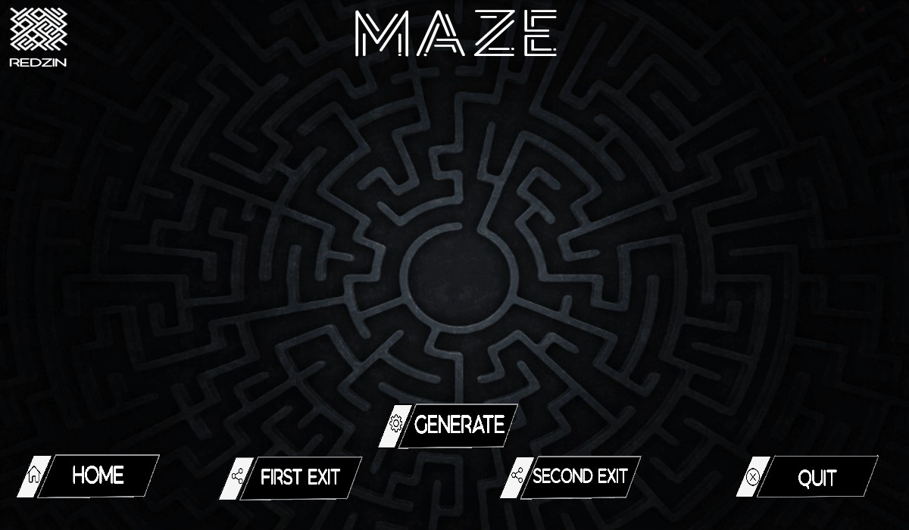

# Maze
A simple C Maze app done with SDL2

>Once you open the app you get the followoing:

# Start Button:
>once you click on the start button, you will be directed to the following page:

# Generate button:
>Clicking on "Generate" will kick off the maze generation, it's a random process, on each generation the final maze is different from the previous one.

# First Exit Button:
>This will show a red rectangle, this rectangle will take the smallest path from entrance which is in top left, to the exit which is in bottom right.

# Second Exit Button:
>This time, it will work with a blue rectangle, it goes from the same entrance as the previous one and exits in top right.

>Quit to exit from the app and Home to get back to the first page.
